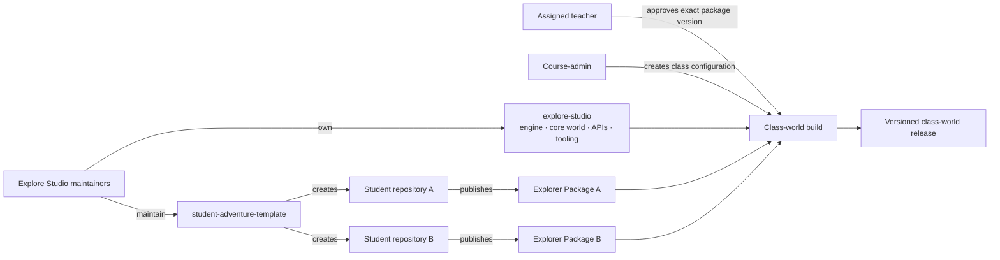
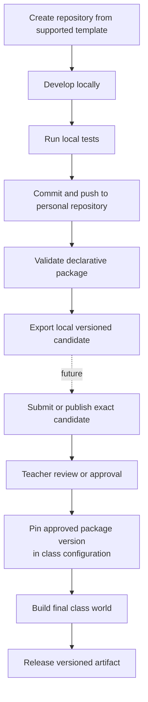
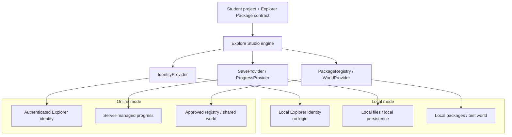
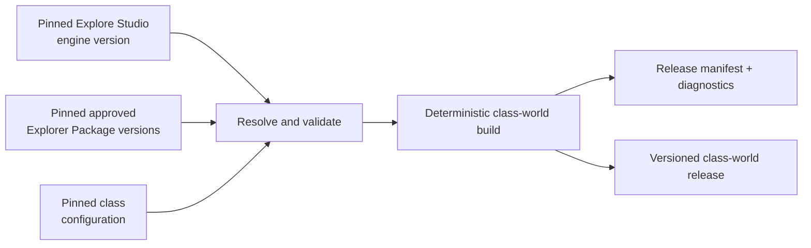

# Explore Studio — Student Contribution and Class-World Model

> *The canonical architecture for student ownership, Explorer Packages, local
> and online execution, educational progression, and reproducible class-world
> releases.*
>
> **Status:** Approved architecture. Package schemas, provider interfaces, and
> operational workflows marked **Proposed** remain subject to prototyping.

---

## 1. Purpose and Scope

Explore Studio separates four concerns that have different owners and release
cycles:

1. the **platform**: the engine, core world, Student API, and shared services;
2. an **individual student project**: source code, assets, tests, and Git history
   owned by one student;
3. a **publishable contribution**: a versioned Explorer Package that crosses
   from a student project into a shared environment; and
4. a **class-world release**: a generated artifact assembled from an exact
   engine version, approved package versions, and class configuration.

This model supports a 30-mission online course for middle-school students while
introducing professional software-development concepts through an
age-appropriate workflow. The missions may be grouped into the six existing
curriculum sprints; missions and sprints organize learning, not source
repositories.

This document defines the target logical architecture and the boundaries that
later implementation must preserve. It does not define a final package schema,
authentication implementation, deployment platform, or executable-code sandbox.

## 2. Decision Vocabulary

This document uses the following labels:

| Label | Meaning |
|-------|---------|
| **Approved** | An architectural decision that later work must preserve. |
| **Proposed** | A concrete starting point that must be tested before it becomes a stable contract. |
| **Deferred** | A decision intentionally left for later security, product, or operational design. |

Unless a subsection says otherwise, statements in this document are approved
architecture. File layouts, schema field names, and conceptual interface names
are proposed.

## 3. Core Design Principles

> **Everything is already built. Students gradually learn how to use it.**

The platform capabilities needed for a course cohort are implemented, integrated,
and tested before that cohort begins. Missions gradually introduce capabilities
that already exist. Course progression must not depend on deploying unfinished
engine features while students are using the course.

> **Every Explorer publishes a package. The class world is built from everyone’s contributions.**

The Explorer Package is the boundary between student-owned work and a shared
class environment. A package can be versioned, validated, reviewed, approved,
and assembled without merging student repositories.

> **The platform is shared. The adventure is yours.**

Maintainers own the stable platform and contribution contract. Each student owns
their project, creative choices, source code, assets, and commit history.

Supporting principles:

- Students can run and experiment locally without authentication.
- Shared online services require authentication and server-side authorization.
- Students own their repositories and commit histories.
- Students do not commit directly to the official engine repository.
- The engine and shared world remain stable while student projects evolve.
- A final class release is reproducible from pinned inputs.
- Student curiosity is encouraged rather than artificially prohibited.

Gradual unlocking is an educational and user-experience mechanism, not a
security boundary. Students may have the complete source code, inspect future
features, and change local configuration. Trusted online systems must still
enforce authorization and package approval.

## 4. Repository Model

### 4.1 Target logical architecture

| Logical boundary | Responsibility |
|------------------|----------------|
| **`explore-studio`** | Official engine, core world, Student API, package contract and validation tooling, and class-world builder. |
| **[`student-adventure-template`](https://github.com/tonyluo2000/student-adventure-template)** | Standalone supported starting structure used to create each student repository. |
| **Student repository** | One independent repository per student, containing that student's source, assets, tests, and package metadata. |
| **Class-world release** | Reproducible, versioned artifact generated from pinned approved inputs. It is not a source repository. |



The student template is now physically separate from `explore-studio` at
[`tonyluo2000/student-adventure-template`](https://github.com/tonyluo2000/student-adventure-template).
Each student repository is created from that template and owns its subsequent
history. The class-world builder remains platform tooling. A class-world release
may be stored in an artifact registry rather than Git.

### 4.2 Current repository state

After the Phase D extraction, this repository contains:

- a local Python engine and Student API v0.1;
- the implemented Explorer Package v0.1 validator, declarative loader, and
  deterministic local export command;
- deterministic local class-world planning, assembly, verification, and release
  bundle contracts from Phase C;
- a pinned integration contract for the standalone student project template;
- immutable identity, cohort, namespace, package-version, authorization, audit,
  and persistence primitives for the Phase E online foundation;
- bounded authenticated publication of one deterministic export into an
  immutable reviewable submission; and
- local lesson examples, tests, and architecture documentation.

The repository does not yet provide an OIDC login/session or upload endpoint,
approval services, an online registry, deployment, or executable student-code
isolation. The implemented
[Phase E Online Foundation v0.1](../phase-e-foundation-v0.1.md) and bounded
[Phase E Package Submission v0.1](../phase-e-submission-v0.1.md) supply trusted
models, policy, verification, and reference persistence for the implemented
foundation and submission slices.
Independent student repositories are still created from the standalone
template.

## 5. Ownership Boundaries

| Area | Owner |
|------|-------|
| Engine | Explore Studio maintainers |
| Core world | Explore Studio maintainers |
| Student template contract and platform tooling | Explore Studio maintainers |
| Standalone template repository | Explore Studio maintainers |
| Student repository | Individual student |
| Student source and assets | Individual student |
| Explorer Package | Student contribution |
| Package contract and validator | Explore Studio maintainers |
| Package approval | One assigned teacher or course-admin; never the submitter/owner |
| Class-world configuration | Course-admin |
| Class-world release | Explore Studio/course team |

Students can collaborate and accept help, but changes to a student repository
remain visible in that repository's history. Interaction with another student's
published character or object occurs through the Student API and package
contracts, not by editing that student's source.

The existing project license applies to material it already covers. Future
student onboarding and publishing workflows must explain the approved licensing,
attribution, and reuse terms before contributions are shared. Package metadata
must preserve attribution, but this architecture does not invent legal terms or
assume that private student work is licensed for public reuse.

## 6. Student Commit-to-Export-to-Publish Workflow



The lifecycle uses six distinct operations:

| Operation | Meaning |
|-----------|---------|
| **Committing** | Records a source change in the student's repository. The student may commit freely and often. |
| **Exporting** | Validates a selected source state and creates a deterministic local Explorer Package candidate. It does not submit anything. |
| **Publishing** | Submits an exact exported candidate through a future trusted workflow. It does not imply approval. |
| **Approving** | Confirms that a specific package version passed automated policy and teacher review for a particular shared use. |
| **Assembling** | Resolves approved pinned inputs and generates a class-world artifact. Repositories are not merged. |
| **Releasing** | Makes a particular assembled artifact available to its intended class environment. |

A Git commit does not export or publish content to the shared world. Export is
local artifact creation and does not imply publication. Publishing does not
imply approval, and approval does not silently update an already released class
world.

## 7. Explorer Package Contract

### 7.1 Contribution boundary

An Explorer Package is an immutable, versioned export from a student repository.
It contains only the declared material needed to validate and load a student's
contribution. It is not a copy of the student's entire repository and does not
transfer ownership of the canonical source.

**Proposed initial shape:**

```text
explorer-package/
├── manifest.yaml
├── character/
├── dialogue/
├── behaviors/
├── quests/
├── assets/
└── tests/
```

Empty directories need not be included. The exact archive format, directory
names, serialization formats, and file extensions remain proposed until the
contract prototype is tested against Student API examples.

The implemented prototype is documented in
[Explorer Package Contract v0.1](../explorer-package-v0.1.md). It deliberately
implements only the declarative subset supported by Student API v0.1; fields
listed below as proposed or deferred are not silently accepted by that contract.
The [Local Explorer Package Loader v0.1](../explorer-package-loader-v0.1.md)
now validates and parses that subset into immutable typed contributions. Engine
registration planning is implemented by
[Student API Registration Adapter v0.1](../student-api-registration-adapter-v0.1.md),
which produces a pure immutable plan without applying it to a world.
[Transactional Registration Plan Application v0.1](../transactional-registration-application-v0.1.md)
now applies one plan atomically to an explicit compatible target.
[Package-Set Preflight and Selection Model v0.1](../package-set-preflight-v0.1.md)
checks an ordered set of exact package pins and registration plans without
applying them.
[Transactional Package-Set Application v0.1](../transactional-package-set-application-v0.1.md)
now applies one valid package-set plan to one explicit target with cross-package
rollback. The
[Immutable Class-World Configuration Model v0.1](../class-world-configuration-v0.1.md)
now declares class-world identity, exact platform and package pins, cohort
metadata, and one validated package-set plan without runtime application or
artifact generation. The
[Serialized Class-World Manifest Schema v0.1](../class-world-manifest-v0.1.md)
now provides deterministic in-memory JSON serialization and strict parsing
against that validated package-set plan. The
[Class-World Manifest File Transport v0.1](../class-world-manifest-file-transport-v0.1.md)
now provides bounded strict UTF-8 reads and canonical atomic local-file
replacement at explicit caller-supplied paths. The
[Class-World Release Identity and Provenance Model v0.1](../class-world-release-identity-and-provenance-v0.1.md)
now declares explicit release identity and authoritative configuration and
package-version inputs without producing an artifact. The
[Class-World Release Declaration Serialization v0.1](../class-world-release-declaration-serialization-v0.1.md)
now provides canonical deterministic JSON and strict parsing against the
authoritative immutable configuration. The
[Class-World Release Declaration File Transport v0.1](../class-world-release-declaration-file-transport-v0.1.md)
now provides bounded UTF-8 reads and canonical atomic local-file replacement at
explicit caller-supplied paths. The
[Deterministic Class-World Release Declaration Digest v0.1](../class-world-release-declaration-digest-v0.1.md)
now identifies canonical serialized declaration bytes with SHA-256 without
reading files or authenticating artifacts. The
[Class-World Release Declaration Digest Verification v0.1](../class-world-release-declaration-digest-verification-v0.1.md)
now validates a supplied expected digest, recomputes the canonical declaration
digest, and returns immutable equality state without reading files or defining
trust. The downstream
[Class-World Release Declaration File Digest Verification v0.1](../class-world-release-declaration-file-digest-verification-v0.1.md)
now composes the authoritative file reader and in-memory verifier. It verifies
the canonical declaration represented by an explicit file, not raw file bytes.
The downstream
[Class-World Package Artifact Inventory v0.1](../class-world-artifact-inventory-v0.1.md)
now joins one successfully verified declaration to exactly one
content-addressed artifact declaration per pinned Explorer Package and emits
them in canonical release pin order. It does not read or hash artifact files.
The downstream
[Deterministic Class-World Assembly Input Plan v0.1](../class-world-assembly-plan-v0.1.md)
now composes that successful inventory into an immutable plan with a canonical
SHA-256 identity over the verified declaration digest and ordered declared
package artifact identities. It performs no artifact I/O or materialization.
The downstream
[Class-World Package Artifact Content Verification v0.1](../class-world-artifact-content-verification-v0.1.md)
now hashes caller-supplied immutable package artifact bytes in canonical plan
order and records deterministic digest match state. It performs no file I/O,
package loading, or assembly-plan recomputation. The downstream
[Class-World Package Artifact File Verification v0.1](../class-world-artifact-file-verification-v0.1.md)
now binds exact packages to canonical root-relative files, rejects escaping or
ambiguous bindings, performs bounded read-only access, and delegates bytes to
the existing content verifier. The downstream
[Deterministic Class-World Materialization Layout Plan v0.1](../class-world-materialization-plan-v0.1.md)
now requires complete matching verification and projects canonical
package-separated output-relative paths without filesystem access. The
downstream
[Verified Class-World Package Artifact Materialization v0.1](../class-world-verified-materialization-v0.1.md)
now reverifies descriptor-confined source files and atomically publishes the
exact verified bytes to a new plan-authorized local output tree. The downstream
[Deterministic Class-World Assembled-Output Manifest v0.1](../class-world-assembled-output-manifest-v0.1.md)
now projects that coherent materialization into canonical package identity,
path, digest, and byte-count records and computes SHA-256 over canonical JSON
without rereading files. The downstream
[Class-World Assembled-Output Manifest File Digest Verification v0.1](../class-world-assembled-output-manifest-file-digest-verification-v0.1.md)
now performs bounded strict UTF-8/JSON readback of one explicit manifest file,
binds its complete ordered fields to that coherent materialization, and
compares the recomputed canonical SHA-256 identity with one explicit expected
digest. The downstream
[Class-World Materialized Output-Tree Verification v0.1](../class-world-output-tree-verification-v0.1.md)
now performs descriptor-confined readback of every manifest-authorized payload
and verifies its byte count and SHA-256. The downstream
[Deterministic Class-World Release Bundle v0.1](../class-world-release-bundle-v0.1.md)
now atomically composes the canonical release declaration, canonical
assembled-output manifest, and verified payloads into one byte-reproducible
stored ZIP with fixed member metadata and a whole-archive SHA-256. Signing,
approval, external publication, authentication, registries, online storage,
and deployment remain deferred.

### 7.2 Manifest responsibilities

The manifest must declare enough information for deterministic validation and
assembly:

| Concern | Contract requirement | Status |
|---------|----------------------|--------|
| Package identity | Stable, class-world-unique package identifier | Approved |
| Author identity | Stable student or Explorer identifier separate from display name | Approved; representation proposed |
| Display name | Age-appropriate name shown in approved interfaces | Approved |
| Package version | Semantic package version | Approved |
| Platform compatibility | Required engine and/or Student API version range | Approved; syntax proposed |
| Exports | Contribution types and their stable identifiers | Approved |
| Entry points | Files or declarations used to register each export | Proposed |
| Dependencies | Explicit package dependencies with compatible versions | Approved; dependency policy deferred |
| Assets | Declared asset paths, media types, integrity data, and attribution | Approved; exact fields proposed |
| Attribution | Creator and approved credit or reuse metadata | Approved; legal vocabulary deferred |
| Capabilities | Behaviors or platform capabilities the package requests | Approved; vocabulary proposed |
| Compatibility | Constraints needed to reject unsupported builds before release | Approved |

Package identifiers and exported identifiers must use a documented namespace
scheme. Display names are not identifiers and need not be globally unique.
Dependency resolution must never fetch undeclared floating versions during a
release build.

### 7.3 Non-normative manifest example

The following YAML is illustrative, not a frozen schema:

```yaml
package:
  id: "alice-fox"
  version: "1.2.0"
  author_id: "explorer-alice"
  display_name: "Alice's Fox"

compatibility:
  engine: ">=1.0.0,<2.0.0"
  student_api: ">=1.0.0,<2.0.0"

exports:
  - type: "playable_character"
    id: "alice-fox.character"
    entry: "character/fox.yaml"
  - type: "dialogue"
    id: "alice-fox.greeting"
    entry: "dialogue/greeting.yaml"

dependencies: []

assets:
  - id: "alice-fox.sprite"
    path: "assets/fox.png"
    media_type: "image/png"
    attribution: "Created by Explorer Alice"

capabilities:
  - "dialogue.basic"
  - "movement.basic"
```

The prototype must decide whether compatibility is expressed as ranges or exact
versions, how integrity hashes are represented, and whether manifests use YAML,
JSON, or another format.

## 8. Supported Contribution Types

Likely Explorer Package exports include:

- playable characters;
- NPC characters;
- dialogue;
- visual assets;
- sound assets;
- behavior configuration;
- quest definitions;
- world objects; and
- decorations.

Each type requires a maintained schema or constrained Student API entry point.
Arbitrary engine replacement, monkey-patching engine internals, changing core
services, and unrestricted modification of the core world are not Explorer
Package contributions. A future executable extension type would require
explicit security design and would not inherit approval merely because other
package content is valid.

## 9. Local and Online Execution Modes

The same student project and Explorer Package contract work in both modes. The
engine depends on interfaces rather than hard-coded assumptions about a local
folder or a remote service.



`IdentityProvider`, `SaveProvider`, `ProgressProvider`, `PackageRegistry`, and
`WorldProvider` are proposed conceptual interfaces, not implementation
instructions or approved names.

### 9.1 Local mode

- No login is required.
- The project runs from the student's machine.
- Development, experimentation, and tests are supported.
- Persistence is local.
- The project may run without internet access.
- Local changes do not automatically affect the shared class world.

A local profile or directory may select a convenient Explorer identity for
development. It is not proof of identity outside that local process.

### 9.2 Online mode

- Login is required.
- The service resolves an authenticated student or Explorer identity.
- Progress and shared-world services are server-managed.
- Shared environments load only approved content.
- A local path, repository folder, manifest claim, or client-provided author
  identifier is not sufficient authentication.

Online authorization determines which authenticated user may upload, approve,
configure, or release content. Authentication and authorization remain
server-side responsibilities even if all client source code is visible.

## 10. Feature Progression and Educational Unlocking

Course planning separates:

1. **Engine capabilities** — stable platform operations such as rendering,
   movement, dialogue, persistence, and package loading;
2. **World systems** — the core world, regions, quests, and shared services; and
3. **Learning content and mission progression** — the 30 missions, teaching
   sequence, hints, and age-appropriate presentation.

Engine capabilities and required world systems are completed and tested before
the course begins. Mission configuration, feature flags, server-side progress,
or a fog-of-war presentation may control what a student encounters next.

Educational unlocking is not a security mechanism. A student with source access
may inspect future features or modify local configuration. Advanced exploration
is curiosity, not misconduct. The course can guide attention without pretending
that readable source is inaccessible.

Security-sensitive operations remain separate:

- online authorization is enforced by trusted server-side systems;
- only approved package versions enter shared environments;
- server-managed progress cannot trust client-only feature flags; and
- access to private data or privileged operations is never granted by mission
  completion state alone.

## 11. Class-World Assembly

A class world is generated from packages; it is not created by merging student
repositories.



The assembly process must:

- keep source repositories and packages independent;
- resolve only package versions pinned by class configuration;
- validate every selected package and its dependencies;
- detect duplicate package identifiers, export identifiers, and other namespace
  collisions;
- pin the engine, Student API contract, packages, dependencies, and relevant
  class configuration;
- produce the same class world from the same content-addressed inputs and build
  rules; and
- retain a release manifest and attribution record.

Generated output must not become the canonical source of student work. A fix to
a student contribution is made in the student's repository, published as a new
package version, approved, and included in a new release.

### 11.1 Proposed class release manifest

```yaml
release:
  name: "Explorer World — Fall 2026"
  version: "2026.1"
  engine_version: "1.0.0"

packages:
  - id: "alice-fox"
    version: "1.2.0"
  - id: "tony-dragon"
    version: "1.1.0"
  - id: "leo-wizard"
    version: "1.0.0"
```

The exact schema is proposed. A reproducible implementation will likely need
additional Student API, integrity, class-configuration, builder, and provenance
fields.

### 11.2 Implemented assembled-output manifest boundary

The implemented
[Deterministic Class-World Assembled-Output Manifest v0.1](../class-world-assembled-output-manifest-v0.1.md)
is narrower than the proposed class release manifest above. It composes an
in-memory record only after successful verified materialization and inherits
that operation's trust boundary.

Its canonical JSON contains, in order, `contract_version`, `packages`, and
`total_bytes`. Each package entry preserves canonical materialization-plan
order and contains, in order, `package_id`, `package_version`,
`digest_algorithm`, `digest_hex`, `relative_path`, and `bytes_written`.
Serialization is compact JSON with UTF-8 content, no insignificant whitespace,
and one terminal line feed. SHA-256 over those exact canonical bytes identifies
the manifest.

Composition performs no filesystem reread and does not reimplement source or
artifact verification. It fails closed unless the complete materialization,
its canonically rebuilt plan, package tuple, authorized paths, declared
digests, byte counts, and aggregate total remain coherent. Manifest file
transport and writing remain deferred. Bounded readback and comparison with an
explicit supplied digest are implemented by
[Class-World Assembled-Output Manifest File Digest Verification v0.1](../class-world-assembled-output-manifest-file-digest-verification-v0.1.md).

Descriptor-confined verification of the manifest-authorized materialized files
is implemented by
[Class-World Materialized Output-Tree Verification v0.1](../class-world-output-tree-verification-v0.1.md).

### 11.3 Implemented deterministic release bundle

The implemented
[Deterministic Class-World Release Bundle v0.1](../class-world-release-bundle-v0.1.md)
is the final local Phase C artifact boundary. It contains exactly the canonical
release declaration, canonical assembled-output manifest, and verified package
payload files in one stored ZIP. Member order, paths, regular-file mode,
timestamp, creator system, extra fields, and comments are fixed. SHA-256 over
the raw ZIP bytes identifies the complete bundle, and equivalent verified
inputs produce byte-identical archive bytes.

Readback is bounded and does not extract members. It binds the exact member set,
metadata, canonical metadata bytes, package byte counts and digests, and the
whole-archive digest back to an authoritative successful output-tree
verification result. This provides deterministic local artifact identity, not
authenticity, approval, publication, or safety to execute package contents.

## 12. Validation and Safety Boundaries

Directly loading arbitrary student Python into an online deployment grants that
code the deployment process's file, network, memory, CPU, and secret access
unless substantial isolation exists. Source review and prohibited-import checks
reduce mistakes but do not create a secure Python sandbox.

The architecture distinguishes:

| Execution category | Trust boundary |
|--------------------|----------------|
| Trusted local execution | A student may run their own Python on their own machine, subject to normal local-computing guidance. |
| Approved constrained content | Declarative data, assets, and behavior expressed through validated APIs may be assembled into the shared class world. |
| Unrestricted arbitrary code | Must not run in a shared service merely because it is inside an approved package. |
| Declarative data/configuration | Preferred shared contribution form where it can express the educational goal. |
| Sandboxed or constrained behavior API | May support richer behavior only within explicitly designed capabilities and limits. |

Expected validation layers are:

1. manifest and contribution schema validation;
2. identifier and namespace validation;
3. engine and Student API compatibility validation;
4. asset declaration, media type, dimensions, and size validation;
5. archive boundary and path-traversal prevention;
6. dependency allow-listing, version resolution, and cycle validation;
7. automated package and contract tests;
8. prohibited import or capability checks if Python extensions are supported;
9. teacher approval and content moderation;
10. isolated builds with no unnecessary secrets or network access;
11. runtime resource limits for any executable contribution; and
12. audit, provenance, and attribution records.

**Deferred security design:** Whether student Python is ever accepted into
shared online releases, and which process, container, virtual machine, WASM
runtime, or other isolation boundary would be required. Explore Studio must not
claim that Python is securely sandboxed until that design is implemented and
independently reviewed.

## 13. Versioning and Compatibility

Four versions evolve independently:

| Version | Meaning |
|---------|---------|
| **Engine version** | Implementation and runtime behavior of the platform. |
| **Student API version** | Stable educational interface and package-facing contract. |
| **Explorer Package version** | Immutable version of one student's published contribution. |
| **Class-world release version** | One generated assembly of pinned engine, package, and class configuration inputs. |

Package validation must fail before release when its declared compatibility does
not include the selected engine or Student API. A new engine release does not
rewrite package versions. A class-world release does not float to newer package
versions after it is built.

Semantic versioning is approved for Explorer Packages. Exact compatibility-range
syntax and versioning policies for pre-1.0 contracts remain proposed.

## 14. Failure Handling

The default is explicit failure with actionable diagnostics:

| Failure | Expected behavior |
|---------|-------------------|
| Invalid package | Reject it and report the manifest path, rule, and remediation. |
| Conflicting package versions | Stop resolution and identify the constraints that cannot be satisfied. |
| Duplicate package identifier | Reject the build and name both sources. |
| Missing asset | Reject the package or build and identify the declaring package and path. |
| Unsupported API version | Reject before assembly and report supported and required versions. |
| One package fails during final build | Fail the class-world build; do not silently omit the student. |

A class configuration may deliberately mark a package optional. In that case,
the build may continue only under an explicit, documented optional-package
policy, and the release manifest and diagnostics must record the omission.

## 15. Privacy and Age-Appropriate Safeguards

Explore Studio is intended for minors. At the architecture level:

- public or class-facing interfaces use Explorer names instead of exposing real
  names unnecessarily;
- student repositories and unpublished package versions are private by default
  and limited to authorized course/cohort scope;
- assigned teachers approve exact versions, while course-admins control
  class-world configuration;
- shared dialogue, images, sound, and other assets are moderated;
- unrestricted public chat is not part of the core package model; and
- account and progress services collect only data needed for the educational
  experience and its operation.

These are product boundaries, not a complete legal, privacy, safety, or
compliance policy. Institution-managed minor accounts/recovery and bounded
least-privilege retention are approved defaults; exact consent text, retention
durations, and regional requirements still require dedicated legal/operational
review before service launch.

## 16. Alternatives Considered

### 16.1 One shared repository with a directory per student

This makes initial setup simple but mixes ownership, exposes students to
unrelated changes, creates noisy history and permissions, and makes the final
world depend on repository merges. It is not selected.

### 16.2 Fork the full engine repository per student

This gives isolation but duplicates the platform, encourages accidental engine
changes, and creates difficult upgrades and divergent histories. It is not
selected.

### 16.3 Manually merge student repositories at the end

This postpones conflicts until the highest-pressure point, makes releases hard
to reproduce, and couples integration to Git history rather than a stable
contract. It is not selected.

### 16.4 One repository per student plus Explorer Packages

This is selected. It preserves student ownership and commit history, keeps the
engine stable, supports validation and approval, and allows a deterministic
builder to assemble independent contributions.

## 17. Follow-Up Implementation Plan

These phases are future work and are not implemented by this decision.

### Phase A — Contract prototype

- Define the package schema.
- Add two example packages.
- Define namespace rules.
- Validate manifests and assets.

### Phase B — Local package loader

- Load approved packages locally.
- Register contribution types through the Student API.
- Produce actionable errors.

### Phase C — Deterministic class-world builder

- Pin engine and package versions.
- Build from class configuration.
- Generate a release manifest.
- Add reproducibility tests.

### Phase D — Student repository template

- Create or formalize the student project template.
- Add local tests and a package-export command.
- Document commit, local export, and future publish as distinct operations.

Phase D is implemented by the standalone
[`student-adventure-template`](https://github.com/tonyluo2000/student-adventure-template),
the pinned [template integration contract](../student-adventure-template-v0.1.md),
and [Deterministic Explorer Package Export v0.1](../explorer-package-export-v0.1.md).
It deliberately stops at a validated, reproducible local export; publishing and
approval remain later trusted workflows.

### Phase E — Online registry and approval

- Add the approved online identity, cohort, namespace, authorization, immutable
  package-version, audit, and concurrency/idempotency foundation.
- Add federated authentication and sessions.
- Add package upload or repository integration.
- Add teacher review.
- Add an approved package registry.

The first bullet is implemented by
[Phase E Online Foundation v0.1](../phase-e-foundation-v0.1.md) under the owner
decisions recorded in
[GitHub issue #31](https://github.com/tonyluo2000/explore-studio/issues/31).
The bounded ingest/application-service portion of the third bullet is
implemented by
[Phase E Package Submission v0.1](../phase-e-submission-v0.1.md); transport
endpoints and repository integration remain deferred. The remaining bullets are
separate later tranches.

### Phase F — Educational progression

- Add mission configuration.
- Add feature presentation.
- Add teacher-controlled progression.
- Add fog-of-war or locked-region UI where educationally useful.

### Phase G — Security hardening

- Design isolation for executable student contributions.
- Enforce resource limits.
- Define moderation.
- Record provenance.
- Retain audit records.

The smallest recommended next slice is Phase A: specify a proposed manifest,
implement a validator for declarative metadata and assets, and exercise it with
two intentionally different example packages.

## 18. Open Questions and Deferred Decisions

- Will repository provisioning use GitHub Classroom or another system?
- What exact archive, manifest, and contribution file formats are used?
- Is student Python ever accepted into a shared release?
- Are packages signed, content-addressed, or linked to repository attestations?
- What teacher-dashboard workflow supports review, approval, revocation, and
  release?
- Which cloud hosting and artifact registry are used?
- What moderation policy and appeals workflow apply to shared content?
- Can approved work enter a long-term community world after a class ends?
- How are package dependencies constrained for age-appropriate debugging and
  reproducible builds?
- Which parts of the core world may packages extend, and which namespaces remain
  reserved?

---

The formal decision record is
[ADR-001: Student repositories and Explorer Packages](decisions/ADR-001-student-repositories-and-explorer-packages.md).
