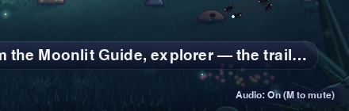
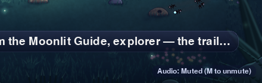

# Moon Meadow audio: runtime evidence

Sound cannot be screenshotted, so this page records what the audio does from the
real runtime. Every table comes from `scripts/capture_trail_audio_evidence.py`,
run against the real Trail scenes, the real renderer, and the real Pygame mixer.
The automated runs use SDL's `dummy` audio driver, so no speakers are needed.
Design notes are in [`docs/trail-audio-v0.1.md`](../../trail-audio-v0.1.md).

Runtime commit: `05843ffd7e257a3120a671b009f45fcae33f7391`.

## Assets

`python3 scripts/capture_trail_audio_evidence.py assets`

| Sound | Cue | Duration | Size | Format | Peak | RMS | Cue volume | Played peak |
|---|---|---|---|---|---|---|---|---|
| `ambient/moon-meadow` (loop) | `ambient_moon_meadow` | 10.00 s | 430.7 KiB | 22050 Hz / 1 ch / 16-bit | -5.7 dBFS | -20.4 dBFS | 0.12 | -24.2 dBFS |
| `sfx/compass-magic` | `compass_magic` | 1.15 s | 49.6 KiB | 22050 Hz / 1 ch / 16-bit | -3.1 dBFS | -17.4 dBFS | 0.22 | -16.2 dBFS |
| `sfx/footstep-grass-a` | `footstep_grass` | 0.08 s | 3.7 KiB | 22050 Hz / 1 ch / 16-bit | -4.4 dBFS | -19.2 dBFS | 0.06 | -28.9 dBFS |
| `sfx/footstep-grass-b` | `footstep_grass` | 0.08 s | 3.7 KiB | 22050 Hz / 1 ch / 16-bit | -4.4 dBFS | -20.0 dBFS | 0.06 | -28.9 dBFS |
| `sfx/lantern-chime` | `lantern_chime` | 1.05 s | 45.3 KiB | 22050 Hz / 1 ch / 16-bit | -3.1 dBFS | -15.5 dBFS | 0.22 | -16.2 dBFS |
| `sfx/mission-complete` | `mission_complete` | 1.70 s | 73.3 KiB | 22050 Hz / 1 ch / 16-bit | -2.5 dBFS | -15.7 dBFS | 0.28 | -13.6 dBFS |
| `sfx/npc-talk` | `npc_talk` | 1.40 s | 60.3 KiB | 22050 Hz / 1 ch / 16-bit | -3.1 dBFS | -15.9 dBFS | 0.24 | -15.5 dBFS |
| `sfx/object-interact` | `object_interact` | 0.34 s | 14.7 KiB | 22050 Hz / 1 ch / 16-bit | -3.1 dBFS | -17.4 dBFS | 0.22 | -16.2 dBFS |
| `sfx/object-near` | `object_near` | 0.45 s | 19.4 KiB | 22050 Hz / 1 ch / 16-bit | -4.4 dBFS | -15.8 dBFS | 0.10 | -24.4 dBFS |
| `sfx/pixel-greeting` | `pixel_greeting` | 0.34 s | 14.7 KiB | 22050 Hz / 1 ch / 16-bit | -3.1 dBFS | -10.3 dBFS | 0.18 | -18.0 dBFS |
| `sfx/ui-mute-toggle` | `ui_mute_toggle` | 0.08 s | 3.5 KiB | 22050 Hz / 1 ch / 16-bit | -6.0 dBFS | -20.6 dBFS | 0.12 | -24.4 dBFS |

There are 11 files, 736,068 bytes (718.8 KiB) in total. When played, the
ambience sits at about -39 dBFS RMS, well below speech. An offline mix of a
scripted M02 run (`... preview OUT.wav`) peaks at -9.9 dBFS. It is not
committed.

## Cue log: once per real event

`python3 scripts/capture_trail_audio_evidence.py events`

Each mission's canonical packages are driven with real input at 60 FPS. Nova
walks to every object and NPC in turn, waits 30 frames, presses E twice (45
frames apart), and then idles. After the first target, it toggles M off and on
again. Footsteps are counted, not listed.

### M01 (visit-all-classroom-objects), 650 frames

No cue is requested, because this mission has no Moon Meadow audio. The mixer is never opened.

### M02 (create-a-classroom-object), 832 frames

| Frame | Cue | Outcome |
|---|---|---|
| 0 | `ambient_moon_meadow` | started |
| 1 | `object_near` | played |
| 76 | `object_near` | cooldown |
| 173 | `lantern_chime` | played |
| 219 | `lantern_chime` | played |
| 274 | `ui_mute_toggle` | played |
| 348 | `object_near` | played |
| 409 | `compass_magic` | played |
| 437 | `mission_complete` | played |
| 455 | `compass_magic` | played |
| 572 | `object_near` | played |
| 621 | `pixel_greeting` | played |
| 667 | `pixel_greeting` | played |

- Footsteps: 36 played over 832 frames.
- Mission complete: 1 request, 28 frames after the completing Compass press.

### M03 (make-your-object-respond), 349 frames

| Frame | Cue | Outcome |
|---|---|---|
| 0 | `ambient_moon_meadow` | started |
| 32 | `object_near` | played |
| 128 | `compass_magic` | played |
| 156 | `mission_complete` | played |
| 174 | `compass_magic` | played |
| 229 | `ui_mute_toggle` | played |

- Footsteps: 10 played.
- Mission complete: 1 request.

### M04 (introduce-your-character), 672 frames

| Frame | Cue | Outcome |
|---|---|---|
| 0 | `ambient_moon_meadow` | started |
| 76 | `object_near` | played |
| 173 | `lantern_chime` | played |
| 219 | `lantern_chime` | played |
| 274 | `ui_mute_toggle` | played |
| 413 | `object_near` | played |
| 461 | `npc_talk` | played |
| 488 | `mission_complete` | played |
| 507 | `npc_talk` | played |

- Footsteps: 32 played.
- Mission complete: 1 request.
- The Lantern chimes only because this script inspects it. A Guide-only run
  has no Lantern cue; see `test_m04_voices_the_guide_and_completion_but_not_an_untouched_lantern`.

### M05 (write-a-short-conversation), 650 frames

No cue is requested.

## Gameplay parity

`python3 scripts/capture_trail_audio_evidence.py parity`

Each scripted run is repeated in a separate process. The table shows the
SHA-256 (first 16 hex) of the gameplay trace: position, target, visited,
spoken, completion, and feedback after each target. The "Mixer unavailable"
column uses a bogus SDL audio driver.

| Mission | No manager | Audio on | Muted at start | Mixer unavailable | Result |
|---|---|---|---|---|---|
| M01 | `00bd93c070dd0225` | `00bd93c070dd0225` | `00bd93c070dd0225` | `00bd93c070dd0225` | identical (mixer never opened) |
| M02 | `e9af99d282884a27` | `e9af99d282884a27` (open) | `e9af99d282884a27` (open) | `e9af99d282884a27` (not open) | identical |
| M03 | `e78a3772f0257c4b` | `e78a3772f0257c4b` (open) | `e78a3772f0257c4b` (open) | `e78a3772f0257c4b` (not open) | identical |
| M04 | `22135fc897d8b483` | `22135fc897d8b483` (open) | `22135fc897d8b483` (open) | `22135fc897d8b483` (not open) | identical |
| M05 | `b0920fe22e63cc60` | `b0920fe22e63cc60` | `b0920fe22e63cc60` | `b0920fe22e63cc60` | identical (mixer never opened) |

Rendered frames are also unchanged. With no manager, or with a failed mixer,
M02-M04 draw exactly the same operations as before. With audio on, the only
addition is the indicator; see `test_no_audio_or_failed_mixer_renders_exactly_like_before`.

## Mute indicator

It appears in the bottom-right corner, at 18 px, on a faint panel, below the
feedback card, and only while a mixer is open. These are crops of the real
M04 frame (the full frame is unchanged otherwise):

| On | Muted |
|---|---|
|  |  |

## Frame time

`python3 scripts/capture_trail_audio_evidence.py benchmark`

The benchmark times headless update + render over 900 frames while walking a
loop and pressing E every second. Each configuration ran twice, interleaved.

| Mission | Audio | Mean (ms) | p95 (ms) | Mixer channels |
|---|---|---|---|---|
| M02 | none | 0.969 / 0.954 | 1.137 / 1.093 | 8 (Pygame default, untouched) |
| M02 | on | 1.013 / 0.979 | 1.211 / 1.168 | 6 (fixed) |
| M04 | none | 0.850 / 0.894 | 0.992 / 1.084 | 8 |
| M04 | on | 0.875 / 0.874 | 1.016 / 1.005 | 6 |

The difference is within run-to-run noise, at most about 0.03 ms. Over 3000
frames of M04, audio allocations stayed at about 7 KB, which is the bounded
128-entry cue log.

## Fresh install from the candidate Course Kit

The Course Kit ZIP is `c45196da…f120ee` (253 members). It was unpacked into a
clean `HOME`, given a fresh `.venv` (Python 3.13.7), and installed with
`pip install -r requirements-student.txt`. The pinned archive resolved from
GitHub.

- `python3 check-my-computer.py`: **READY FOR EXPLORE STUDIO**, with course
  tools `05843ff (current)`.
- The installed wheel ships `engine/assets/trusted_audio` with all 11 WAVs and
  the manifest.
- The canonical `explore-package trail` commands for S02, S03, and S04 (the S02
  run after `make-my-world.py`) were driven by an autopilot that patches only
  input polling:

| Run | Mixer | Result | Cues |
|---|---|---|---|
| S02, dummy driver, M at frames 120/150 | open | M02 complete | ambience, near, Lantern; Compass **muted** while muted; unmute tick; complete; Pixel |
| S03, dummy driver, M at frame 120 | open | M03 complete | ambience, near, Compass, complete |
| S04, dummy driver, M at frames 120/150 | open | M04 complete | ambience, near, Lantern, near (muted), unmute tick, Guide bell, complete |
| S04, **real macOS CoreAudio device**, `EXPLORE_STUDIO_AUDIO=muted` | open | M04 complete | every cue `muted` (nothing audible) |
| S04, no audio device (bogus driver) | not open | M04 complete | every cue `unavailable`, with one line on stderr: "Trail audio unavailable; continuing silently" |
| S04, `EXPLORE_STUDIO_AUDIO=off` | no manager | M04 complete | none |
