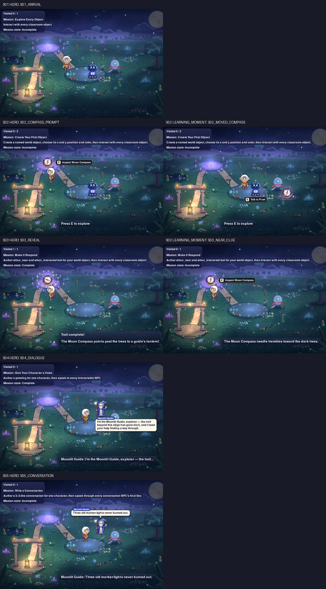

# Journey snapshots: S01–S05 (review evidence)

Review-only evidence for the published Journey snapshots. The published files
live in `course4teen-website/public/journey/sNN/`, and their provenance lives
in `course4teen-website/journey/snapshots.json`, which is not served. This
folder holds only a contact sheet of those files, so the images are not
duplicated here.



## What was captured

Each snapshot is a real Classroom Trail frame. It is driven headlessly with the
session's canonical task-card command (packages, `--player`, `--mission-id`),
real input, and fixed 1/60 s steps. The audio manager is off, as with
`EXPLORE_STUDIO_AUDIO=off`, so there is no audio indicator and gameplay is
unchanged. A frame is accepted only after the harness has checked the state it
shows: the target, the text actually drawn, trusted art actually drawn for
every required entity, and no art or entity from a later session.

| Session | Moment | Kind | File | 960w | 480w |
| --- | --- | --- | --- | ---: | ---: |
| S01 | `S01_ARRIVAL` | HERO | `journey/s01/hero.webp` | 79,574 B | 30,094 B |
| S02 | `S02_COMPASS_PROMPT` | HERO | `journey/s02/hero.webp` | 93,166 B | 33,918 B |
| S02 | `S02_MOVED_COMPASS` | LEARNING_MOMENT | `journey/s02/moved-compass.webp` | 93,546 B | 34,374 B |
| S03 | `S03_REVEAL` | HERO | `journey/s03/hero.webp` | 93,946 B | 34,392 B |
| S03 | `S03_NEAR_CLUE` | LEARNING_MOMENT | `journey/s03/near-clue.webp` | 92,898 B | 34,356 B |
| S04 | `S04_DIALOGUE` | HERO | `journey/s04/hero.webp` | 96,326 B | 35,194 B |
| S05 | `S05_CONVERSATION` | HERO | `journey/s05/hero.webp` | 95,776 B | 35,584 B |

What each check verifies:

- **S01 HERO:** the arrival in Moon Meadow, not completion. Nova walks a few
  paces onto the Landing Site (`walk_to 340, 262`), turns to face the camera
  (one real `down` frame), and settles (2.0 s); the frame is accepted only
  with Nova at (342, 265), nothing targeted (so no prompt is drawn), nothing
  visited, and M01 incomplete. The Moon Meadow backdrop is drawn, and Nova,
  Pixel, and the Crystal Lantern are drawn in trusted art; the empty stone
  circle is scenery. There is no Moon Compass, no Moonlit Guide, and no retired
  Fern (`forest-guide:guide`) or River Fountain (`river-fountain:fountain`).
  The frame is pixel-identical to the reviewed Phase B hero,
  `docs/visual-proof/s01-moon-meadow-arrival/s01-arrival.png`.
- **S02 HERO:** Nova is beside the Moon Compass and `Inspect Moon Compass` is
  drawn. Nova, Pixel, the Compass, and the Lantern are drawn in trusted art.
  There is no Guide and no S03 Compass.
- **S02 moved Compass:** a temporary copy of the student Compass is set to the
  repo-canonical `x: 690`, `y: 360`, and the Compass is drawn there.
- **S03 HERO:** after `E`, the package's `when_interacted` text is drawn and M03
  is Complete. The trusted Compass art is drawn. There is no Pixel, Lantern, or
  Guide.
- **S03 near clue:** before `E`, the package's `when_near` text and the prompt
  are drawn, and nothing has been visited.
- **S04 HERO:** the Moonlit Guide's whole greeting is in the bubble, with the
  `Moonlit Guide` speaker tag. The Guide and the Lantern are drawn in trusted
  art. The Lantern has no waypoint marker, because M04 has no
  `lantern_waypoint`. There is no S05 content.
- **S05 HERO:** the conversation in progress, not completion. Nova walks
  beside the Guide (`walk_to 455, 262`) and presses `E` twice. The frame is
  accepted only with the S05 Guide targeted, M05 Incomplete, the package's
  middle line (`conversation[1]`, so `dialogue[1]`) whole in the bubble under
  the `Moonlit Guide` tag, and `Moonlit Guide: <that line>` drawn as the HUD
  echo. The S05 package's Guide (`moonlit-conversation:guide`) wears the
  trusted Moonlit Guide art, and the Lantern is drawn lit with no waypoint.
  The frame shows no S04 greeting Guide, Pixel, either Compass, or any of
  S06's collection (`starlight-garden:*`), and there is no completion banner.

## Provenance

- Base: `main` at `ba648aa808e408a85f5d44ed052839d487909eee` (#116, Course
  Journey Phase D).
- Runtime pin (Course Kit `COURSE_PLATFORM_COMMIT`):
  `b70c8a9e2defdff383c532fd23c783524fcd7717` (S05 in the Moon Meadow). The
  harness refuses to publish
  unless the working tree's presentation runtime (every `runtime` file below)
  is byte-identical to the runtime at the pin. A test re-reads the pin from
  git to confirm this.
- Manifest schema: `explore-studio/journey-snapshots@2`. `--check` refuses a
  missing, unknown, or unsupported schema. Version 1 had no capture
  implementation fingerprint, so its entries were recaptured, not relabelled.
  The S02–S04 source frames and all ten WebP files came out byte-identical to
  the version 1 capture.
- S01 hashes: source frame `sourceRgbSha256`
  `7aed2bd8fa53ecb851de1370b8338be1712bb410a2ad662a7f05b8e640b3453b`;
  `hero.webp` `d651f128a98319a27b8f6d764470a697ec6c567006f847dc0f89c1b0edf9d6c6`;
  `hero-480.webp` `65d2552b81500777773a29e9aa1ae77d9e4c01f8dbadf8cdf09bb93e1571fe74`.
- S02–S04 after the move to the `3038cf4` pin: every source frame and all ten
  WebP files are byte-identical to the captures at the previous pin
  (`05843ff`). Only their `runtimeCommit` and fingerprints changed: `runtime`
  (the pinned runtime moved), `captureRecipe` (the `untargeted` expectation
  added for S01), and `captureImplementation` (the harness edits). Their
  `packages` parts are unchanged.
- S01–S04 after the move to the `b70c8a9` pin: every source frame and all
  twelve WebP files are byte-identical to the captures at `3038cf4`. Only their
  `runtimeCommit` and fingerprints changed: `runtime` (M05 joined the
  presentation policy), `captureRecipe` (each earlier row now excludes the S05
  Guide), and `captureImplementation` (list-item package text and step arity
  checks). Their `packages` parts are unchanged.
- S05 hashes: source frame `sourceRgbSha256`
  `112cb1f09ec267e9538b54b8f321945b7f4f05b633954b2af2030f4a70af1039`;
  `hero.webp` `5a5509bf6aa84ce43985b58dcbc1359e7c43b99c891800bf1408c11bd1a17d69`;
  `hero-480.webp` `e9ee2662089b42e3392d11cdc0e0f161f7751ede75e56558e70fb653a84492c8`.
- Presentation fingerprints, per moment: `S01_ARRIVAL` `8c0709c69f45…`,
  `S02_COMPASS_PROMPT` `55bdaedaaa07…`, `S02_MOVED_COMPASS` `8ccef6d2f465…`,
  `S03_REVEAL` `c0060bc3bc59…`, `S03_NEAR_CLUE` `9c33a4ee75b3…`, `S04_DIALOGUE`
  `a047e966b90e…`, `S05_CONVERSATION` `bd2a11026412…`. The full values are in
  the manifest.
- A fingerprint hashes four parts. The manifest's `fingerprintInputs` lists
  exactly what each one covers:
  - **runtime** (`RUNTIME_GROUPS` in `scripts/journey_snapshots.py`):
    everything between the package files and the drawn frame.
    - `engine-core`: `engine/_color.py`, `_config.py`, `_platform.py`.
    - `rendering`: `engine/rendering/**`, including the per-mission
      presentation policy.
    - `scene`: `engine/scenes/**`, `entities/**`, `animation/**`, `input/**`,
      `interactions/**`, and `engine/audio/_trail_audio.py`. The scene calls
      the audio bridge every frame, and it draws the audio indicator.
    - `trusted-art`: the trusted sprite sheets and the code that loads them.
    - `curriculum`: `explore/curriculum/**`.
    - `package-pipeline`: `explore/packages/**` (loader, models, policy,
      validator, package-set planner, registration adapter, Trail plan and
      scene construction) and `explore/_colors.py`.

    Excluded, each with a reason in `RUNTIME_PIXEL_INERT`: audio playback and
    cues, the trusted audio loader and clips, the windowed `App` loop,
    logging, and the Student API v0.1 classes. A test walks the harness's
    imports statically. It fails if the harness reaches an `engine` or
    `explore` module that is neither fingerprinted nor justified there.
  - **packages:** every file of each task-card package.
  - **captureRecipe:** the task-card command (packages in order, `--player`,
    `--mission-id`), the session row, the moment, the frame size, and the
    WebP settings.
  - **captureImplementation:** the bytes of
    `scripts/capture_journey_snapshots.py`, `scripts/journey_snapshots.py`,
    and `scripts/trail_driver.py`. These hold the fixed time step, real
    input, frame selection, acceptance checks, and encoding. Any edit to
    these files needs a recapture, which only refreshes the manifest when
    the frames are unchanged.

  When any part changes, `--check` and `tests/test_journey_snapshots.py` fail
  with a message that names the part, for example: "Journey snapshot for S03
  (S03_REVEAL) is stale: session package files changed; rerun `python
  scripts/capture_journey_snapshots.py --session S03`".
  `tests/test_journey_snapshot_freshness.py` makes real edits in a temporary
  mirror of the repository and runs `--check` against it. Edits to rendering,
  presentation policy, the registration adapter, the
  loader/models/planner/Trail construction, colours, package YAML, the time
  step, frame selection, acceptance, session config, or the task-card command
  must fail it. Audio-only code, website prose, docs, and the window title must
  not.
- Publishing also refuses unless every `runtime` file in the working tree
  matches the Course Kit runtime pin. So a package-pipeline or colour edit
  blocks publishing just as a renderer edit does.
- The Journey snapshots workflow watches every fingerprint input. A test
  matches the workflow's path filters against the real input files, so the
  two lists cannot drift apart.
- Toolchain at capture: Python 3.13.7, pygame 2.6.1, SDL 2.28.4, SDL_ttf
  2.20.1, Pillow 12.3.0, libwebp 1.6.0, darwin-arm64.

## Encoding and hashes

- Canonical source frame: 960×640 RGB. It is not committed.
- Published: a 960w WebP, and a 480w WebP downscaled from the same source with
  `LANCZOS`. Neither is rendered separately.
- WebP: lossy, quality 90, method 6. The input is opaque RGB, so the output is a
  plain `VP8 ` chunk with no alpha, EXIF, ICC, XMP, or timestamps. Each image is
  well under the 150 KB budget.
- **Hash policy:**
  - `sourceRgbSha256` (the raw frame) is authoritative for regeneration on the
    recorded toolchain.
  - The `images.*.sha256` values verify the committed files on any machine.
  - Byte identity across toolchains is not promised: font rasterization and
    the WebP encoder can differ between pygame, SDL_ttf, Pillow, and libwebp
    builds.

  `tests/test_journey_snapshot_determinism.py` always captures each moment
  twice and requires identical frames and WebP bytes. It compares against the
  manifest only when the toolchain matches, and skips that comparison with an
  explanation otherwise.

## Regenerate

The committed files were produced by exactly these commands, in order:

```bash
python scripts/capture_journey_snapshots.py --all-published
python scripts/capture_journey_snapshots.py --contact-sheet docs/journey-proof/snapshots/contact-sheet.png
python scripts/capture_journey_snapshots.py --check
python scripts/capture_journey_snapshots.py --all-published --dry-run
```

One session, or a look without publishing:

```bash
python scripts/capture_journey_snapshots.py --session S01
python scripts/capture_journey_snapshots.py --session S01 --preview /tmp/journey-preview
```

Snapshot encoding needs Pillow, from `pip install -e ".[dev,art]"`.

## Publication boundary

`public/journey/` holds exactly `s01/`–`s05/`: the fourteen files the manifest
lists, nothing else. The manifest's `deferred` list is empty. `--check` and the
tests reject a file or manifest entry for an unpublished session (S06+), a
deferred row, a moment the table does not have, a duplicate entry, and any
stray file, including one inside `s01/`.

A row can still be deferred (`deferred=` in `scripts/journey_snapshots.py`);
the harness then refuses to publish it, and `--check` rejects its files and
entries. No row is deferred now.

The S01 negative cases are real captures in
`tests/test_journey_snapshot_determinism.py`: with M01's Moon Meadow
presentation removed the frame is rejected (standard Trail), the retired cast
is rejected (no Pixel; Fern and the Fountain in the scene), and the exact
canonical start is rejected because Pixel is in range and the `Talk to Pixel`
prompt is drawn.
