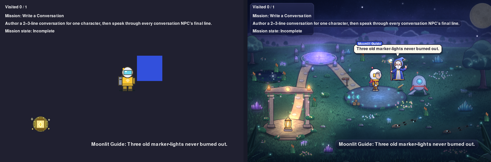

# S05 in the frozen Moon Meadow: the conversation (review evidence)

Focused evidence that S05 (M05 `write-a-short-conversation`) now wears the
existing Moon Meadow presentation, and that nothing about the lesson changed.
Every image is a real Classroom Trail frame from the canonical S05 task-card
command (Nova, the Crystal Lantern, and the S05 package's Moonlit Guide), with
real input and fixed 1/60 s steps:

```bash
SDL_VIDEODRIVER=dummy PYTHONPATH=<main checkout> \
  python3 scripts/capture_s05_visual_proof.py docs/visual-proof/s05-moon-meadow-conversation --only before
SDL_VIDEODRIVER=dummy python3 scripts/capture_s05_visual_proof.py docs/visual-proof/s05-moon-meadow-conversation
```

`<main checkout>` was `main` at `ba648aa`, before this change.

## Before and after



Left: `main` at `ba648aa`, where M05 had the plain Trail and the S05 Guide was a
blue rectangle. Right: this branch. The scene, positions, and HUD text are the
same in both frames. Only the presentation differs: the Moon Meadow plate, the
trusted Nova and Moonlit Guide art, the HUD panels, and the Guide's speech
bubble. `comparison-start.png` shows the same pair at the canonical start.

## The conversation, step by step

| Frame | What it shows |
| --- | --- |
| `s05-start.png` | The exact canonical start. Nova, the lit Lantern (no waypoint marker), and the Guide in trusted art. The talk cue floats over the Guide. |
| `s05-approach.png` | Beside the Guide: the `Talk to Moonlit Guide` prompt. |
| `s05-line-1.png` | First `E`: `dialogue[0]` whole in the bubble under the `Moonlit Guide` tag. The HUD repeats it. M05 is Incomplete. |
| `s05-line-2.png` | Second `E`: the middle line. This is the Journey HERO state (`S05_CONVERSATION`). M05 is still Incomplete. |
| `s05-line-2-480x320.png` | The same frame at a half-scale screen share. The bubble stays readable. |
| `s05-line-3-complete.png` | Third `E`: the final line, `dialogue[-1]`. M05 is now Complete. There is no confetti and no "Mission complete!" banner, because M05 has no `celebration`. |
| `s05-after-final-line.png` | After the bubble ends, the talk cue stays gone (the final line has been shown) and the prompt returns. |
| `s05-restart.png` | One more `E` wraps the conversation back to line one, and M05 stays Complete. This is the task card's restart prediction. |

## What changed, and what did not

- **Policy:** M05 joins `MISSION_PRESENTATIONS` with S04's Guide treatment
  (`talk_cue`, `dialogue_focus`, `meadow_audio`). It also has one sprite alias,
  `moonlit-conversation:guide` -> `moonlit-guide:guide`, because the S05
  package ships the same Guide under its own id (S03 aliases its Compass the
  same way). There is no `celebration`, discovery label, or Lantern waypoint.
- **Bubble:** each line of a 2-3-line conversation gets the existing dialogue
  bubble. Before this change, only a single-line greeting did. The bubble
  repeats the scene's own feedback line and keeps no second position.
- **Talk cue:** for a conversation NPC, the cue stays until the final line has
  been shown, which is exactly what M05 waits for. A greeting NPC keeps M04's
  spoken-to rule.
- **Audio:** the existing cues only. The moon bell plays on line one (the
  audio bridge already ignored lines two and three), and the completion motif
  plays once.
- **Unchanged:** the M05 completion rule, the dialogue order and wraparound,
  the package, the starter, and every S01-S04 frame. The S01-S04 Journey
  snapshots recapture byte-for-byte. `tests/test_s05_presentation.py` shows a
  scripted M05 run is identical with and without presentation.
- **No new art, cue, or animation system.** The art is the frozen Moon
  Meadow: the plate, Nova, the Moonlit Guide, and the Lantern.
