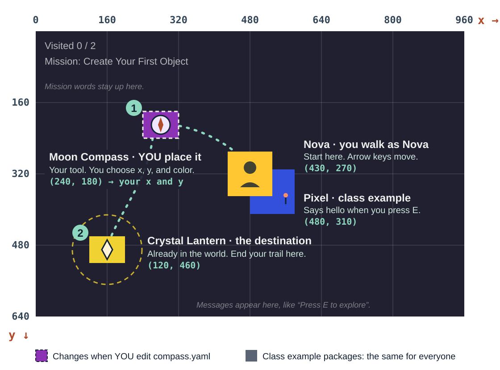

# S02 Task Card — Place Your First Prop

**Mission:** M02 `create-a-classroom-object` — Create Your First Object

**Learning target:** Store names, integer x/y coordinates, and a color in
variables; explain which values are strings and which are integers; predict an
object's position; then adjust one coordinate from evidence.

Use the shared [`Student Quick Start`](../../student-quick-start.md) before
beginning.

## Who will explore your world?

Share the explorer and companion you imagined after Session 1:

- your explorer's name, appearance, personality, and one interest or favorite
  subject;
- your companion's name, kind or type, personality, and one specialty or
  interest;
- one future ability you eventually want your companion to be able to do.

Your companion cannot do that yet. As you learn more Python, you'll teach it.

## Explorer, companion, tool, world object

| Kind | Example | What it is |
|---|---|---|
| Explorer | Nova | The character who explores. You move Nova on the Trail. |
| Companion | Pixel | Nova's small, curious, careful robot friend. |
| Tool | Moon Compass | Something an explorer uses. Today you place it. |
| World object | Crystal Lantern | Something that is part of the world. |

Nova and Pixel are the **class examples**. Your own Explorer and Companion
live in your own files (below).

Pixel appears in today's Trail and says hello when you press E nearby. Pixel
stays where it was placed: it does not follow Nova or make its own decisions
yet. Those are things you'll learn to program over the year.

## Your trail today



- **Start:** you walk as Nova, in the middle of the screen.
- **1 — Moon Compass (your tool):** it sits wherever **your** `x` and `y`
  put it, in **your** color.
- **2 — Crystal Lantern (the destination):** already part of the world, in the
  bottom-left corner. Walk near it and the screen says *The lantern glows
  warmly.*
- Press **E** at both. `Visited 2 / 2` completes the mission, in any order.

In the Trail, Nova, Pixel, the Moon Compass, and Crystal Lantern appear as
simple pictures. Names are not drawn on screen; the labels and symbols are
map-only. A thing without a known picture still appears as a plain colored box.

## Python first: variables and values

```python
object_name = "Moon Compass"
x = 240
y = 180
color = "purple"
```

- `x = 240` means: store the integer value `240` under the variable name `x`.
- `=` is **assignment**: it stores a value under a name.
- `"Moon Compass"` and `"purple"` are **strings**: text inside quotes.
- `240` and `180` are **integers**: whole numbers with no quotes.
- `x = "240"` would store text, not a number. Same digits, different type.

## Make your own world folder

Your explorer and companion belong to you, so they live in your own folder,
**not** inside the course folder. From the course folder root, run:

```console
python3 make-my-world.py
```

It creates `my-explore-world` next to your course folder. If you run it again,
it only adds missing files and never replaces your work.

Already have a `my-explore-world` folder from an earlier class? Keep using it.
Open your existing `explorer.py` and `companion.py` and edit your own values
there — you do not need to run `make-my-world.py` again, and you do not need
to replace your files to get today's credit.

Open `my-explore-world/explorer.py` and `my-explore-world/companion.py` in your
editor. Replace **every** `TODO` string with concrete choices for your own
Explorer and Companion — do not leave Nova or Pixel as your answers. If you
already personalized these files in an earlier class, there won't be any
`TODO` left to replace — just check that your own values are still the ones
there. Choose:

- Explorer: `explorer_name`, `looks_like`, `personality`, and
  `favorite_subject`;
- Companion: `companion_name`, `companion_kind`, `personality`, `specialty`,
  and `future_ability`.

`future_ability` is only a plan written as text; it does not make the Companion
act by itself. Keep the quotation marks. Then run:

```console
python ../my-explore-world/explorer.py
python ../my-explore-world/companion.py
```

If your workspace is new this year, each file prints a card:

```text
==========================================
  MY EXPLORER CARD  (designed by me)
==========================================
Name:          Comet
Looks like:    a bright orange scarf
...
```

If you set up `explorer.py` and `companion.py` in an earlier class, running
them prints your earlier lines instead, for example:

```text
Explorer: Comet
Looks like: a bright orange scarf
...
```

`Comet` is a made-up sample. Both outputs are correct — the format doesn't
matter. Your output shows **your** values either way.

Checkpoint: every printed value in your output is yours, and you can say why
each one is a string.

### What each value does today

| Values | Edit in | You see it | Changes the Trail? |
|---|---|---|---|
| Explorer: `explorer_name`, `looks_like`, `personality`, `favorite_subject` | `explorer.py` | Your explorer output (Card or printed lines) | No. Display only. |
| Companion: `companion_name`, `companion_kind`, `personality`, `specialty` | `companion.py` | Your companion output (Card or printed lines) | No. Display only. |
| Companion: `future_ability` | `companion.py` | "PLAN for later" in your output | No. A plan for later. |
| Moon Compass: `x`, `y` | `compass.yaml` | Where the compass box sits | **Yes.** It moves. |
| Moon Compass: `color` | `compass.yaml` | The compass box color | **Yes.** |
| Moon Compass: `name` | `compass.yaml` | Stored in the file | No. Names are not drawn yet. |

| File | What it is for |
|---|---|
| `lessons/sessions/s02/student/starter.py` | Practice today's Python. |
| `my-explore-world/explorer.py`, `companion.py` | Your own characters that you keep all year. |
| `my-explore-world/projects/moon-compass/` | Your editable S02 Explorer Package. |

## Your first expedition tool

The Moon Compass is the expedition's first instrument, and **you** decide
where it lives. The Crystal Lantern is already in the world and marks the end
of the trail. Where you place the compass is a world decision, not just a
coordinate exercise: put it somewhere an explorer would actually notice it and
want to reach on the way.

## The bridge to the world

The YAML object file—not `starter.py`—drives the shared runtime.

| Local Python value | Declarative YAML field | Visible world result |
|---|---|---|
| `object_name` | `name` | Stored as the prop's name (not drawn on screen yet) |
| `x` | `x` | Left/right position; larger moves right |
| `y` | `y` | Up/down position; larger moves down |
| `color` | `color` | Named fill color |

Copy the intended values yourself into your Student Workspace file:
`../my-explore-world/projects/moon-compass/objects/compass.yaml`. Python does
not generate or execute the package. The lesson-safe range is x = 80–800 and y
= 100–500. This is a classroom visibility guide, not a new schema rule.
Supported colors are `red`, `orange`, `yellow`, `green`, `blue`, `purple`,
`pink`, `brown`, and `gold`.

## Predict before running

Where should this important instrument be placed, and why? Sketch or describe
where `(240, 180)` should appear so an explorer passing through would notice
it. Predict what increasing x by 100 will do before changing anything.

## Core path

1. Personalize `object_name`, `x`, `y`, and `color` in `starter.py`.
2. Run the Python file and explain the type of each value.
3. Put the same values in your student-owned
   `../my-explore-world/projects/moon-compass/objects/compass.yaml`. Do not edit
   the seed package inside the Course Kit.
4. Validate before launching:

   ```console
   python lessons/sessions/s02/student/starter.py
   explore-package validate ../my-explore-world/projects/moon-compass
   ```

5. Checkpoint: show `valid: ...` and point to the YAML file that drives runtime.
6. Launch:

   ```console
   explore-package trail \
     examples/explorer-packages/nova-character \
     examples/explorer-packages/pixel-companion \
     examples/explorer-packages/crystal-lantern \
     ../my-explore-world/projects/moon-compass \
     --player "nova-character:nova" \
     --mission-id "create-a-classroom-object" \
     --name "S02 Place Your First Prop"
   ```

7. Observe the position, close the Trail, change either x or y once, validate,
   and relaunch. Interact with every world object. Pixel is a character, so
   saying hello does not change `Visited`.
8. Checkpoint: state prediction, coordinate change, and observed movement.

## Debug checkpoint

Explain why `x: "240"` is the wrong type, then repair it without changing the
number. If validation fails, fix only the first reported issue and retry.

## Common S02 failures

- Invalid color: choose one lowercase supported name above.
- YAML indentation: use spaces and align `name`, `x`, `y`, and `color`.
- Off-screen object: return to the lesson-safe range, validate, and relaunch.
- Old position: close the old Trail, save the Student Workspace YAML, validate,
  and relaunch.
- `make-my-world.py` stopped: read its message; it never deletes anything. Ask
  the teacher before choosing a different folder.

## Support path

Keep the sample name/color and change only one coordinate. Ask the teacher to
check indentation before you retype the file. In `explorer.py`, change just
`explorer_name` first.

## Extension path

Make a second evidence-based coordinate adjustment after predicting it.

## What we discovered

Read [What We Discovered](discovery.md): coordinates, maps, and navigation,
and how Nova's fictional Moon Compass differs from a real magnetic compass.

## Exit check

Answer briefly:

- **Python:** What is a variable? Which values today were strings? Which were
  integers? What does changing `x` do?
- **Your world:** What are your Explorer's name, appearance, personality, and
  interest or favorite subject? What are your Companion's name, kind,
  personality, and specialty or interest? What future ability do you want to
  program later?
- **Discovery:** What do coordinates describe? How is Nova's fictional Moon
  Compass different from a real magnetic compass?

After class, reread [What We Learned in Python](python-notes.md).

## Looking ahead

Today's Moon Compass is a static instrument — it sits where you placed it and
does nothing else yet. Next session, it gains its own clue and reveal,
becoming an active part of the expedition story.

## AI receipt

Record: intent; prediction; exact bounded question; suggestion tested;
accepted/rejected change; student explanation.

**Do not paste whole files or ask AI for a complete solution.**

## Git close

**ZIP path check:** Do this section only if your course folder is Git-managed (the Derived student repository path) or your class has already started the Git lesson. On the ZIP path before that lesson, skip it — see [Student Quick Start → Later: Git](../../student-quick-start.md#later-git-optional-teacher-managed).

```console
git status --short
git diff
git add lessons/sessions/s02/student
git diff --staged
git commit -m "Place a moon compass prop"
```

Use the Quick Start for `M`, `??`, no-output meanings, cancellation, identity
recovery, and retry. Understanding comes before a rushed commit.
